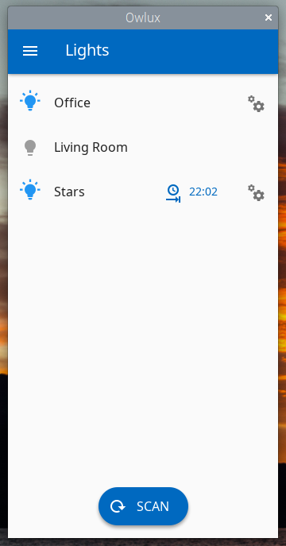
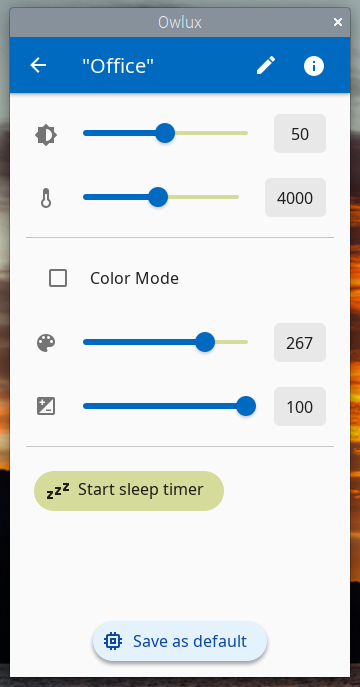

Owlux: Yeelight control app for Raspberry Pi
============================================

About
-----

Owlux is a smart light control app. It allows to control the WiFi based Yeelight smart LED
bulbs and ceiling lights. It allows you to change temperature, brightness and color of the
smart bulbs and support programming the light's sleep timers. (For firmware updates and
commissioning lights to your WiFi hotspot you still need to use the official Yeelight app.)

Screenshots
-----------




Building on your Raspberry Pi
-----------------------------

In the scripts/ subfolder you will find a script to build and install Owlux
from sources. It will also install needed dependencies.

```
wget https://raw.githubusercontent.com/frankencode/Owlux/master/scripts/install_pi_11.sh
./install_pi_11.sh
```

The build process takes about 20min on a Pi 400. Please make sure that you have proper cooling if you are using a different Raspberry Pi!

Disclaimer
----------

Yeelight is a trademark Qingdao Yeelink Information Technology Co., Ltd.
The authors of Owlux are not affiliated with Yeelink.
Use Owlux on YOUR OWN RISK!
